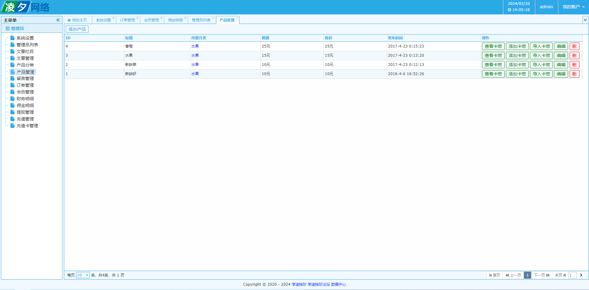
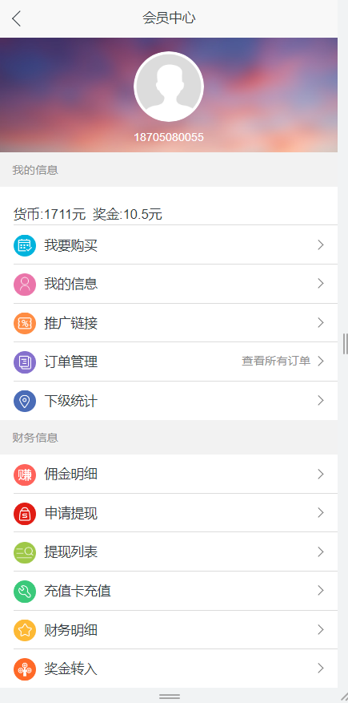

**扫码 >> 源码商城 获取** 

 **郑重声明：项目经过本地测试，确保可以运行， 可以用于学习和毕业设计参考~** 

## 1.源码介绍

开发语言：Java
开发框架：Struts2+Spring+Hibernate
后台用到Freemarker模板引擎
服务器环境：JDK1.8+Tomcat8.0+Mysql5.7

>PS:如果想用于毕业设计/论文，题目示例：基于SSH的水果商城系统的设计与实现

## 2.安装教程

1. 下载源码，解压到本地，将代码导入到IDEA或者Eclipse中；
2. 通过Navicat或其他的数据库图形化工具，创建数据库，将fenxiao0220.sql导入到mysql数据库中；
3. 修改源码中数据库信息，修改文件：WEB-INF\classes\database.properties
>jdbc.user=数据库用户名
jdbc.password=数据库密码
jdbc.driverClass=com.mysql.jdbc.Driver
jdbc.jdbcUrl=jdbc:mysql://数据库IP:3306/数据库名?useUnicode=true&characterEncoding=UTF-8&autoReconnect=true

4. 添加Tomcat Local server，运行项目。
>后台路径：http://域名/admin
后台用户名：admin
密码：admin

### 3.后台功能

>系统设置
管理员列表
文章栏目
文章管理
产品管理
留言管理
订单管理
会员管理
财务明细
佣金明细
提现管理
充值管理
充值卡管理  

## 4.微信/H5端

>我要购买
我的信息
推广链接
订单管理
查看所有订单
下级统计
财务信息
佣金明细
申请提现
提现列表
在线充值
充值卡充值
财务明细
奖金转入
会员转账

------

代码获取地址：https://x-x.fun/e/KT4a50d4aemWw  💕🤞

